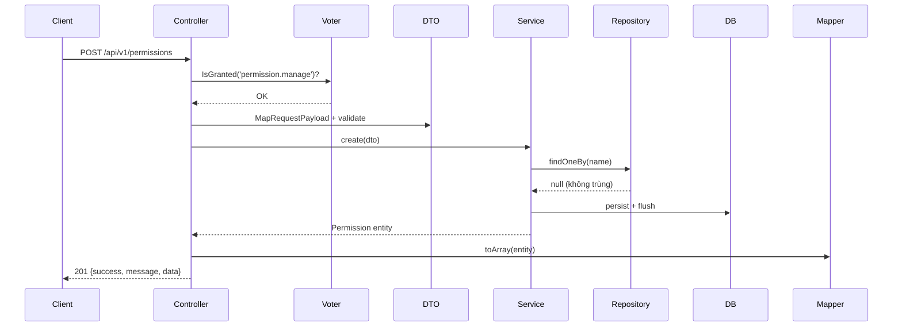

# Design: Permission CRUD API

## Kiến trúc (theo structure.md — không đổi pattern)

```
Request → Controller (#[IsGranted]) → MapRequestPayload → DTO (validate)
        → Service (business logic + Doctrine) → Mapper → Response
```

## File cần tạo/sửa

| File | Thay đổi |
|---|---|
| `src/Dto/Permission/PermissionRequestDto.php` | field `name` (NotBlank, Length max 255) |
| `src/Http/Mapper/PermissionMapper.php` | expose `id`, `name`, `createdAt` |
| `src/Service/PermissionService.php` | `list/create/update/delete`, check unique `name` trong `create`/`update` |
| `src/Controller/Api/V1/PermissionController.php` | 5 route chuẩn, `#[IsGranted('permission.view'|'manage')]` |
| `src/DataFixtures/PermissionFixtures.php` | thêm `permission.view`, `permission.manage` |

## Luồng check unique (trong Service)

```php
public function create(PermissionRequestDto $dto): Permission
{
    if ($this->repository->findOneBy(['name' => $dto->name]) !== null) {
        throw new ConflictHttpException('Permission name already exists.');
    }
    // ... persist
}
```

## Mermaid — luồng request store



## Rủi ro / điểm cần chú ý

- Migration: `Permission` entity đã tồn tại sẵn — không cần `make:entity`,
  chỉ cần đảm bảo cột `name` có unique index ở DB level (không chỉ check ở
  code) để tránh race condition
- Fixtures: thêm permission mới KHÔNG được xoá permission cũ đã gán cho Role
  hiện có — dùng `--append` khi load lại nếu DB đã có data thật
